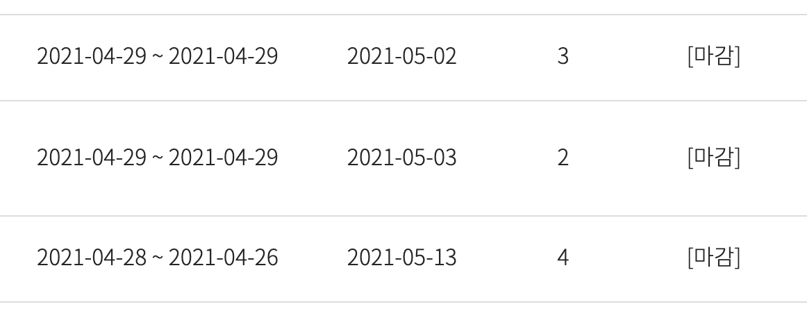
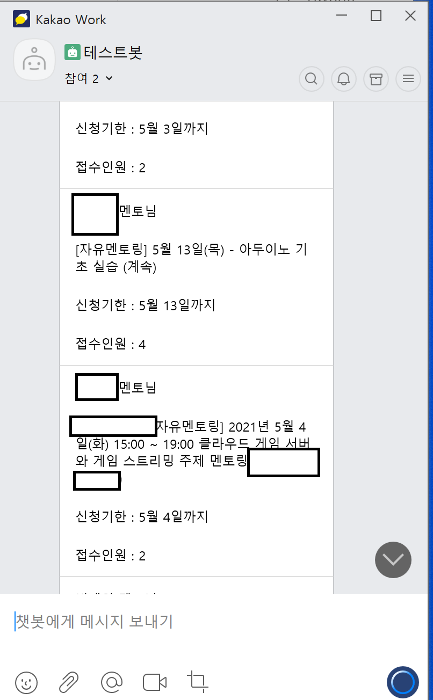

# 이칠이조
- 팀장
    - 이민욱

- 팀원
    - 김찬혁
    - 김태호
    - 이민욱
    - 이철희
    - 한승준

## 기획 내용
멘토님들이 올리시는 멘토링은 선착순 신청입니다. 그래서 순식간에 멘토링이 마감되곤 합니다...

4월 29일 오후 8시 기준,
4월 29일에 모집 시작한 공고가 이미 마감되었음을 확인할 수 있습니다.

멘토링 신청을 위해 항상 사이트를 접속하는 귀찮음, 번거로움을 줄여 
연수생분들의 편의를 증진하고자 
멘토링이 올라온다면 주기적으로 크롤링을 한 뒤, 
1시간 단위로 알림을 보내주는 서비스를 기획했습니다.

## 사용법
채팅방이 만들어진 뒤 새로운 멘토링이 있다면 챗봇이 1시간 단위로 새로운 멘토링 공지를 보내게 됩니다.
- 멘토님 성함 
- 멘토링 제목 
- 신청 기한 
- 현재까지 접수 인원

공고가 여러 개 올라왔을 경우에는 목록 형태로 볼 수 있습니다.

원하는 공고에 올라왔다면,
사이트에 접속해 멘토링을 신청하시면 됩니다. 

**챗봇 예시**

- 기술적인 부분은 생략하겠습니다.

